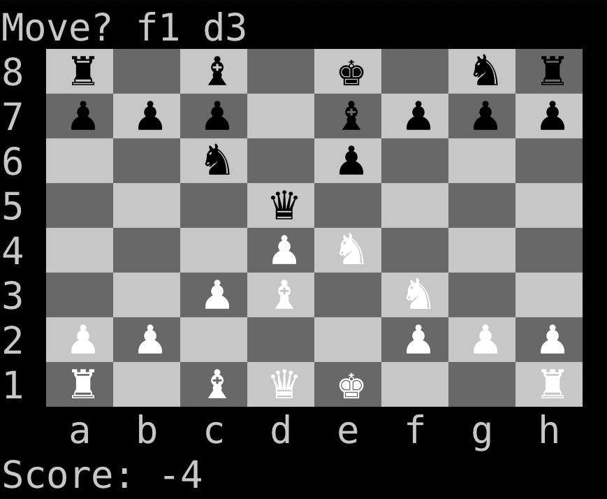

# freaky-chess

This is a low bandwidth side hustle!
You'll find that:

- the computer doesn't play very well, and
- the graphics are painfully '70s retro. :(

## Quick Start Installation Instructions

**Note:** If you intend to participate in the _development_ of the code then:

1. Fork this repository:

    

2. Follow the remaining instructions, below, but in step 3 clone your new fork, instead of this repository.

3. When you're ready to contribute your first improvement and/or bug fix, contact me and I'll walk you through the process of submitting a GitHub _Pull Request_.

If you just want to install and play `freaky-chess` then follow these instructions:

1. [Install _Git_](https://git-scm.com/downloads).
2. [Install _Stack_](https://docs.haskellstack.org/en/stable/install_and_upgrade/).
3. Clone this _Git_ repository:

    
    
4. At a command prompt, type: `git clone `, paste what you just copied in step 3, and hit `<RETURN>`.
    
    Depending upon your platform and terminal application, pasting may be achieved using one of:
    
    - `<CTRL>-v`
    - `<CMD>-v`
    - `<SHIFT>-<INSERT>`

5. Move into the newly created directory and type: `stack build`.

    You should see a lot of "work" being done by the `stack` package manager and the _Haskell_ compiler (_GHC_).
    This all may take some time to complete the first time it runs.
    
6. Type: `stack exec freaky-chess-exe`, and hit `<RETURN>`.
    
    You should be presented with a chess board and asked to make a move.
    Try: `e2 e4`, to get the game rolling.

## My Intent

My aim here was _not_ to invent a new competitor to _Stockfish_, but rather to go through the exercise of codifying _reasonably good_ and _shallow_ heuristics for board evaluation.

- By _reasonablly good_ I mean that I don't expect the computer to beat me, but just to maintain my interest and, perhaps, surprise me once in a while.

- By _shallow_ I mean that I intend to have the computer look no further ahead than, say, 5 moves, because that is about my own limitation.

**What I'm really after is improving my own game play, by going through the exercise of _codifying_ board evaluation heuristics.**

I'm hoping that this execise in _heuristic codification_ shifts my brain in a way, such that my own play improves.

## My Approach

I selected _Haskell_ as my programming language for this project, for the following reasons:

1. Application development in _Haskell_ is very fast and nimble.
And I don't have a lot of time to give this project.

1. _Haskell_ code tends to be easier for non-hackers to read and reason about than the other languages in which I'm proficient, for a couple reasons:

    - It is very succinct.
    
    - It reads more like math than other languages.

    - It has an _analytical_ and _functional_ nature, which most left-brainers find intuitive.
    
1. I've tried to take the breakout of subordinate (i.e. - "helper") functionality into separate, top-level functions to a pedantic extreme, specifically to facilitate meaningful discussion of the codified heuristics among hackers and non-hackers alike.

## My Desire

I seek to discuss the codified board evaluation heuristics with other Chess players (hackers or not) of a roughly similar level to myself, for the purposes of:

- improving the code here, and

- better understanding why certain changes work better than others, in the context of shallow evaluation (i.e. - typical Human play).

## FAQ

### I don't speak _Haskell_ and have no desire to learn. Can you quickly bootstrap my understanding of these "codified heuristics" and how you write them?

Taking the [`mobilityByPlayer()` function](https://github.com/capn-freako/freaky-chess/blob/c80e1680827723484066317f92b18908ab123cf9/src/Chess/Play.hs#L67-L69) as an example:

```haskell
mobilityByPlayer :: PlayerScore
mobilityByPlayer clr brd =
  sum $ map (length . validNewPos brd) $ positionsByPlayer clr brd
```

Ignore the first line.
It gives the functions _type_, which is not of immediate interest right now.

The function's _definition_ starts with the second line, continuing onto the third (because of the indent there).
It is most easily read from right to left, segmented by the "$"s as follows:

1. The `positionsByPlayer()` function is called for the current player (`clr`), White or Black, given the current board (`brd`).

    - This function generates a list containing every board position occupied by a piece of the given color.

1. Some function, `(length . validNewPos brd)`, is `map`ed over that list, which just means that it gets applied to every _element_ in the list independently, replacing that element with the function result.

    - The actual function used here is a _composition_ (indicated by the dot) of two separate functions: `length()` and `validNewPos()`.
    And `validNewPos()` comes "primed" with its first argument: `brd`.
    The net result at each element of the original list is: `length(validNewPos(brd, <element>))`
    
    - Decomposiing this result from inside to out:
    
        1. The `validNewPos()` function generates a list of all possible moves for the piece at a particular board position.
        
        1. The `length()` just gives the length of this list, which is a measure of how many moves that piece could make, i.e., its _mobility_.

1. Finally, the `sum()` function just adds up the mobilities of all pieces of the given color, yielding that player's _total mobility_.

### Can you show me an example of what it looks like to play _freaky-chess_?

Here is a screen shot of a game terminated after the second move:



Wrt/ _score_, positive numbers favor White, while negative numbers favor Black.
